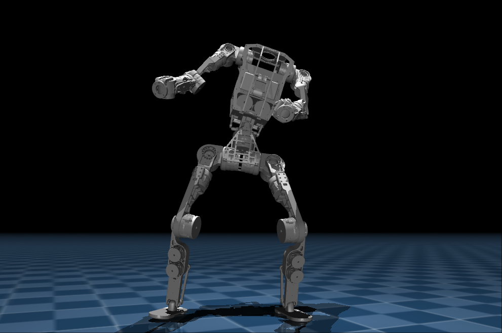
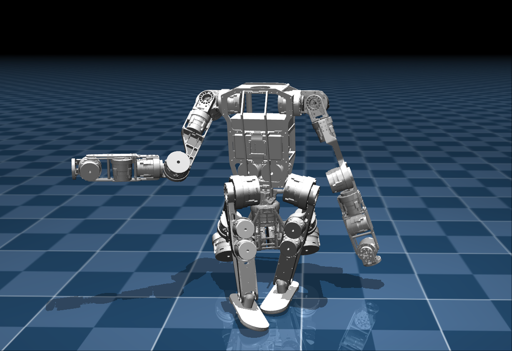

# 基于beyondmimic的舞蹈

<p align="left">
  
</p>

# 基于host的倒地起身  

<p align="left">
  
</p>

## 简介

本仓库为半醒科技基于amp，beyondmimic和host的控制器程序，可以运行并控制运行在mujoco仿真环境的机器人或真机机器人。    
本控制框架基于`ROS2`开发，其中ROS2环境和mujoco仿真包[`bxi_ros2_pkg`](https://github.com/bxirobotics/bxi_ros2_pkg)为预编译二进制包：  
*  `bxi_ros2_pkg/`目录：
1. `communication`：机器人通信包定义，包含自定义的通信包格式
2. `description`:机器人描述文件，包含机器人`urdf`文件以及`meshe`文件
3. `mujoco`:机器人仿真环境，用于提前验证算法，所有算法在真机运行之前必须使用仿真环境进行验证
4. `hardware`:机器人硬件控制包，启动后本节点发布机器人所有传感器数据，并接收控制指令

## 使用说明

### 版本说明
1. `elf3`:精灵3 基于beyondmimic的动作模仿示例


### 系统环境以及依赖
真机已配置好环境，到手即可使用，重新安装系统后或者在其他机器运行仿真需重新配置环境。具体如下：
1. 系统版本需为`Ubuntu 22.04`，并安装对应版本`ROS2`
https://blog.csdn.net/weixin_55944949/article/details/140373710
2. 运行`mujoco`仿真需安装`libglfw3-dev`
`sudo apt install libglfw3-dev`
3. 子模块`bxi_ros2_pkg`通过`git clone https://github.com/bxirobotics/bxi_ros2_pkg.git`下载 
4. 将`source xxx/bxi_ros2_pkg/setup.bash`加入`.bashrc`，运行真机需以`root`用户运行
5. 运行强化学习示例需安装`torch` `onnxruntime` `onnx` `pygame` 
`pip install onnx`
`pip install torch`
`pip install pygame`
`pip install onnxruntime`
7. 将`./script/bxi-dev.rules`复制到`/etc/udev/rules.d/`
8. 设置遥控器自启动，按需修改`./script/ros_elf_launch.service`,复制到`/etc/systemd/system/`,使用`systemctl`工具使能自启动服务

### 仿真与真机差异

1. 仿真环境设置了虚拟悬挂，启动后机器人默认为悬挂状态，需要在初始化时释放悬挂（真机运行时忽略悬挂相关信号）
2. 仿真环境有全局里程计`odm`话题，可以在前期简化算法开发，启动`hardware`时没有这个话题
3. 仿真环境有真足底力传感器`touch_sensor`，真机传感器还在开发中。`hardware`虽然也发布了足底力，但是非常粗略的估计值，有更高的精度要求可以根据四足中的触底状态估计算法进行估计

### 软件系统介绍

1. `hw`为`hardware`的缩写，所有带`hw`后缀的`launch`文件代表启动真机，请谨慎运行
2. 仿真环境和真机可以使用完全相同的控制代码，只用切换`launch`文件即可在仿真和真机之间切换，仿真代码的话题使用`simulation/`前缀，真机话题使用`hardware/`前缀，具体可看`src/example`中的话题参数设置
3. 话题中的控制指令必须按给定的关节顺序发送，关节顺序见例程`src/bix_example`
4. 仿真和真机均设置有失控保护，丢失控制指令`100ms`后触发保护，触发保护后电机失能，需重新初始化才可使用

### 启动流程

仿真和真机启动时电机都处于失能状态，所有参数均不可控，启动流程分为两步，第一步初始化使能电机的位置控制，电机可以设置`pos kp kd`三个参数实现位置控制，第二步初始化使能全部控参数，电机可以设置`pos vel tor kp kd`，具体启动示例可以参考`src/bxi_example_py`

### 编译/运行示例代码
示例代码简单描述了如何订阅接收传感器消息，调用初始化服务并对机器人进行一个简单的位置控制    
1. 将 ROS2环境和mujoco仿真包[`bxi_ros2_pkg`](https://github.com/bxirobotics/bxi_ros2_pkg) 放到 /opt/bxi/bxi_ros2_pkg , 并激活它：
   `source /opt/bxi/bxi_ros2_pkg/setup.bash`    


## install
```bash
git clone https://github.com/MelodyAI/bxi_elf3_ws.git
git clone https://github.com/MelodyAI/bxi_ros2_pkg.git
```

## build
```bash
cd bxi_elf3_ws

rm -rf ./build/ ./install/ ./log/

source /opt/bxi/bxi_ros2_pkg/setup.bash

colcon build
```

## quick start
普通用户连接遥控器后，按下左腰杆启动仿真，按下右腰杆关闭仿真
管理员权限连接遥控器，按下左摇杆启动真机，按下右摇杆急停真机
```bash
sudo killall remote_controll
cd bxi_elf3_ws
source /opt/bxi/bxi_ros2_pkg/setup.bash
source install/setup.bash
ros2 launch remote_controller remote_conroller_launch.py 
```

## sim2sim
```bash
cd bxi_elf3_ws
source /opt/bxi/bxi_ros2_pkg/setup.bash
source install/setup.bash
ros2 launch bxi_example_py_elf3 example_dance.launch.py
```

## sim2real
```bash
sudo su
source /opt/bxi/bxi_ros2_pkg/setup.bash
source install/setup.bash
ros2 launch bxi_example_py_elf3 example_dance_hw.launch.py
```


### 硬件保护
硬件节点除了通信超时保护之外还带有扭矩保护，超速保护，位置保护
1. 硬件节点内部有一个错误计数，错误计数达到`1000`时电机退出使能状态
2. 错误计数逻辑：接收到一个电机速度超限时错误计数`+50`，接收到扭矩超限时错误计数`+100`，正常接收电机消息错误计数`-1`，最小值为`0`
3. 位置超限保护触发时不增加错误计数，仅超限方向失去控制能力，只能向非超限方向转动
4. 各超限值联系我司获取，非必要不建议更改

## 注意事项
大尺寸机器人有一定的危险性，每一步操作之前一定仔细检查！所有控制程序必须经过仿真后才可上真机运行，有任何异常及时按停止按钮！
